## Long's GitHub Learing Process

### 一. 关于git bash终端文件目录的基本操作

#### Windows路径 vs Git Bash路径
|Windows            |Git Bash|
|-------            |-----   |
|`C:\Users\long`    |`/c/Users/long`|
|`D:\long_git`      |`/d/long_git`|

#### 当前目录
`pwd`: 当前在哪
`ls`: 当前目录有什么
    - `ls -l`: 详细列表
    - `ls -a`: 包含隐藏文件
    - `ls -la`: 常用组合

#### 切换目录`cd`
`cd /d`: 切换到D盘(Windows专属)
`cd ..`
`cd ../..`
`cd ~`

#### 文件(夹)操作
- 建目录
`mkdir <name>`
`mkdir -p a/b/c`: 直接建多级目录
- 建文件
`touch demo.py`: 新建空文件
- 删除
`rm 文件名`
`rm -r 文件夹名`
- 复制文件  
`cp a.txt b.txt`
`cp -r src dst`: 复制文件夹,从源头(src)到目的(dst)
- 移动/重命名 
`mv oldname.py newname.py`
`mv a.py ../temp`

##### 重要补充点`git mv`
**在git的工作区对被跟踪的的文件(夹)进行删除`rm`或者重命名`mv`时,要是用`git rm`和`git mv`**,这样进行之后,git会自动把变化更新到stage暂存区

#### `echo`和`find`
**`echo`是bash语法的一个关键词,下面介绍一下他的作用**
1. 展开通配符:
    ```bash
    echo *.txt
    输出: a.txt b.txt c.txt
    ```
2. `echo`+变量
    ```bash
    name=long
    echo $name
    输出: long
    ```

**`find`在==目录树==中递归查找文件,并对结果执行操作**
基本结构: `find 路径 条件 操作`
`find .`: 列出当前目录下的所有文件和子目录
`find . -name "*.py"`: 查找相应文件名,从当前目录开始找
- `*.py`一定要加引号,防止shell先展开
- 除了`-name`这个条件外,还有`-mtime`,`-size`,`-type`等条件

`find . -name "*.log" -exec rm {} \`: `-exec`表示对找到的每个文件执行命令,`\`是`-exec`结束标志.

#### 文件批量rename
```bash
for f in image?.png; do
    mv "$f" "img${f#image}"
done
```
`${f#image}`表示变量f去掉前缀`image`,比如: `image2.png`-->`2.png`,最后和img拼接成`img2.png`

---

### 二. Git版本控制基本操作

#### git config查看配置
`git config --global --list`
git配置是三个层级
|层级   |命令   |存放位置   |
|------|--------|---------|
|系统级|`--system`|Git安装目录|
|用户级|`--global`|`~/.gitconfig`<br>最常用,也可以`cat ~/.gitconfig`|
|仓库级|`--local`|`.git/config`|

也可以只查看一个配置项: `git config user.name`(默认先查local,再查global)

#### git commit
`git init`: 给当前文件夹创立git版本库
`git commit -m "wrote a readme file"`
```bash
long@LAPTOP-P0JHDVD6 MINGW64 /d/long_git/learn_git (master)     
$ git add readme.txt

long@LAPTOP-P0JHDVD6 MINGW64 /d/long_git/learn_git (master)     
$ git commit -m "wrote a readme file"
[master (root-commit) 4b98757] wrote a readme file
 1 file changed, 2 insertions(+)
 create mode 100644 readme.txt
```
`-m`: 后面输入本次提交的说明
`1 file changed`: 1个文件被改动
`2 insertions`: 插入了两行内容
为什么Git添加文件需要`add`，`commit`一共两步呢？因为`commit`可以一次提交很多文件，所以你可以多次add不同的文件，比如：
```bash
$ git add file1.txt
$ git add file2.txt file3.txt
$ git commit -m "add 3 files."
```
#### 当前库状态
- `git status`: 掌握库当前的状态
    - `modified: readme.txt`: 表示`readme.txt`被修改过

`git diff`
```bash
long@LAPTOP-P0JHDVD6 MINGW64 /d/long_git/learn_git (master)     
$ git diff readme.txt
diff --git a/readme.txt b/readme.txt
index 629f6b7..be836b4 100644
--- a/readme.txt
+++ b/readme.txt
@@ -1,2 +1,2 @@
-Git is a version control system
+Git is a distributed version control system
 Git is free software
\ No newline at end of file 
```
**关键信息**
| 部分     | 意义                 |
| ------ | ------------------ |
| `@@ -1,2 +1,2@@` | 变化范围说明 |
| `-1,2` | 旧文件：从第 1 行开始，共 2 行 |
| `+1,2` | 新文件：从第 1 行开始，共 2 行 |
|`\ No newline at`<br>`end of file`|git提示文件末尾没有换行符|

`git log`: 显示当前版本之前的从最近到最远的提交日志
`git log --pretty=oneline`: 以一行来输出
> 你看到的一大串类似1094adb...的是**commit id(版本号)**

#### 版本回退`git reset`
首先，Git必须知道当前版本是哪个版本，在Git中，**用`HEAD`表示当前版本**，也就是最新的提交`1094adb...`（注意我的提交ID和你的肯定不一样），上一个版本就是`HEAD^`，上上一个版本就是`HEAD^^`，当然往上100个版本写100个`^`比较容易数不过来，所以写成`HEAD~100`。

##### 关于`HEAD^`
在普通提交上`A-->B-->C(HEAD)`:
- `HEAD^`=`HEAD~1`=B
- `HEAD~2`=A

在**merge commit**上,比如:
```bash
*   97e834f (HEAD -> master) merged bug fix 101
|\
| * 9c88076 (issue-101) fix bug 101
|/
*   8cec79a merge with no-ff
```
有两个父提交,第一个父提交是`8cec79a`,第二个是`9c88076`
- `HEAD^` == `HEAD^1` == 第一个父提交
- `HEAD^2` == 第二个父提交


`reset`等于**移动HEAD**
`[--hard | --mixed | --hard]`:只决定是否重置暂存区,工作区
`git reset --hard HEAD^`
| 参数| 意义(区别在于暂存区和工作区是否保留)|
| ------ | -------- |
| `--mixed`(默认)|回到上个版本的工作区<br>(文件已修改,还没有`add`)|
| `--soft`|回到上个版本的暂存区<br>(`add`之后,`commit`之前) | 
| `--hard` | 回到上个版本的文件未修改状态<br>(压根没修改) |

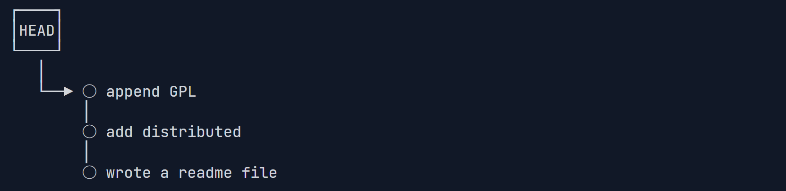`reset`之后
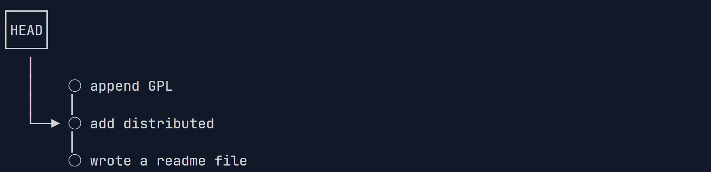
`git reflog`: 记录每一次命令
```bash
long@LAPTOP-P0JHDVD6 MINGW64 /d/long_git/learn_git (master)     
$ git reflog
d5c6451 (HEAD -> master) HEAD@{0}: reset: moving to d5c64 # 开头的commit id 表示执行后面命令之后的结果
1197a5e HEAD@{1}: reset: moving to HEAD^
d5c6451 (HEAD -> master) HEAD@{2}: commit: append GPL
1197a5e HEAD@{3}: commit: add distributed
4b98757 HEAD@{4}: commit (initial): wrote a readme file每一次命令,
```

### 三. 工作区和暂存区


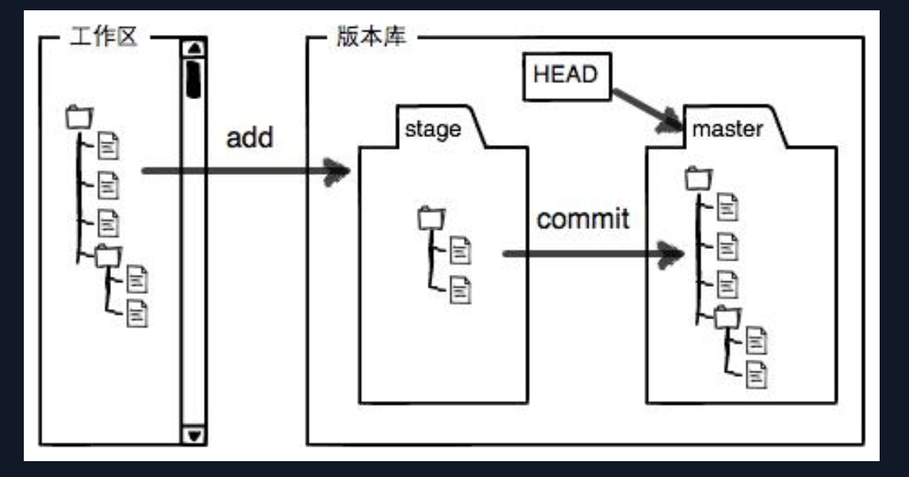**工作区**就是文件夹页面
**版本库(Repository)**是在`git init`之后创建的,用`.git`来表示
版本库中存在一个**缓存区(stage)**
`commit`只会**关注缓存区的情况**,若未`add`便开始`commit`则在工作区的变化不会被提交

#### 撤销修改
**1. 撤销工作区修改**
`git checkout -- <file>`: 把文件在**工作区**的修改撤销
两种情况:
1. 文件修改后还没有`add`放到stage区,此时撤销将回到**版本库一模一样的状态**  
2. 文件已经添加到暂存区,之后又做了修改,此时撤销将回到**添加到暂存区之后的状态**

**2. 撤销暂存区修改(unstage)**
`git reset HEAD <file>`: 可以把暂存区的修改撤销掉(unstage),重新放回工作区

#### 删除文件
在工作区的操作即为普通的删除文件:`rm <file>`
若要继续吧git版本库中的删除了,可以`git add <file>`,然后`commit`;也可以`git rm <file>`再`commit`. 对于删除文件而言,`add`和`rm`都是将工作区的修改(这里具体指删除)给添加到暂存区.

### 四. 远程仓库
#### SSH
SSH(Secure Shell)是**一种加密的免密码的远程通信方式**
SSH的**核心**是: **密钥对**
|类型|在哪|能否给别人|
|----|---|-----|
|私钥`id_rsa`|你电脑|绝不能|
|公钥`id_rsa.pub`|Github|可以|

##### SSH密钥对机制
背后发生的事情是：
1. GitHub 生成一个 随机挑战字符串
2. GitHub 用你的 公钥 对这个挑战“上锁”
3. 把这个“上锁的问题”**发给你**
4. 你用 私钥 解锁（签名）
5. ️GitHub **用公钥验证结果**
6. 验证成功 → 放行

#### 生成SSH密钥对
`ssh-keygen -t rsa -C "ljlong6@qq.com"`
参数解读
1. `ssh-keygen`: 生成(generate)SSH密钥对的工具
2. `-t rsa`: `-t`(type)后面跟密钥算法类型
    | 算法| 特点| 推荐度|
    | --------- | --------- | ----------- |
    | `rsa`| 经典、通用| 可用但不推荐新建 |
    | `ed25519`| 更安全、更短、更快 | **推荐**|
    | `ecdsa`| 椭圆曲线| 一般|
3. `-C "<comment>"`: `-C`(comment)后是给公钥的一个注释,注释内容随意

**查看**
`cat ~/.ssh/id_ed25519.pub`
`ls ~/.ssh`

#### 添加远程库`git remote add`
分步走
1. `git remote add origin git@github.com:long6177/learn_git.git`
远程库的名字就是`origin`,这是git默认叫法
2. `git push -u origin <name>`
    - 将指定分支`<name>`(用`git branch`查看)推送到远程
    - `-u` 由于远程库是空的，我们第一次推送`master`分支时，加上了`-u`参数，Git不但会把本地的`master`分支内容推送的远程新的`master`分支，还会把本地的`master`分支和远程的`master`分支关联起来，在以后的推送或者拉取时就可以简化命令,直接用`git push origin master`

#### 删除远程库
`git remote -v`: 查看关联的远程库信息
```bash
    $ git remote -v
    origin  git@github.com:long6177/learn_git.git (fetch)
    origin  git@github.com:long6177/learn_git.git (push)   
```
结果显示了可以**抓取**(fetch)和**推送**(push)的远程库,若无推送权限,就看不到推送的地址

`git remote rm <name>`: name可以是仓库地址,也可以是`origin`,这里的"删除"是指**解除本地与远程的绑定关系**

#### 从远程库克隆
`git clone git@github.com:long6177/gitskills.git`

你也许还注意到，GitHub给出的地址不止一个，还可以用`https://github.com/michaelliao/gitskills.git`这样的地址。实际上，Git支持多种协议，默认的`git:/`使用ssh，但也可以使用`https`等其他协议。

### 五. 分支管理
> `master`/`main`是默认分支(branch),`HEAD`其实是**指向的`master`这一分支**,而分支才是直接指向新的提交

#### 创建分支
`git checkout -b dev`
- `-b`表示创建新分支并转换到该分支
- 相当于两步`git branch dev` + `git checkout dev`

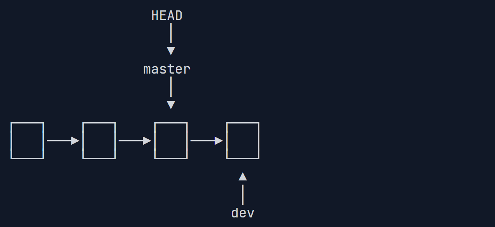 
#### 合并分支
**切换分支**: `git checkout master` 切换到`master`分支

`git merge dev`: **合并指定分支(这里是dev)到当前所处分支(这里指master)**

#### 删除分支
`git branch -d dev`: 删除分支dev

#### 切换分支
`git checkout <branch>` == `git switch <branch>`
`git checkout -b <branch>` == `git switch -c <branch>`


#### 合并冲突(merge conflict)
当出现如下分支时,`git merge <branch>`无法快速合并(**fast merge**)
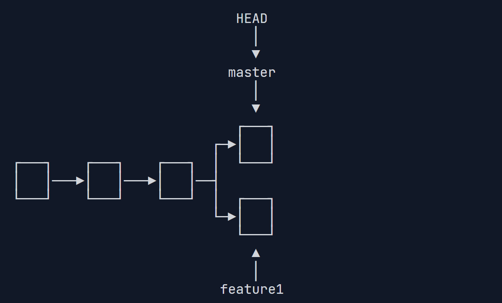`git merge feature1`后,git后说出`merge conflict`,之后使用`git status`可以查看冲突的文件
```bash
$ git merge feature1
Auto-merging readme.txt
CONFLICT (content): Merge conflict in readme.txt
Automatic merge failed; fix conflicts and then commit the result.
```

并且此时git会在有合并冲突的文件中进行标记:

```text
Git is a distributed version control system.
Git is free software distributed under the GPL.
Git has a mutable index called stage.
Git tracks changes of files.
<<<<<<< HEAD
Creating a new branch is quick & simple.
=======
Creating a new branch is quick AND simple.
>>>>>>> feature1
```

这时我们要手动修改来解决冲突,之后进行`git add readme.txt` + `git commmit -m "confllict fixed"`,此时分支就变成了
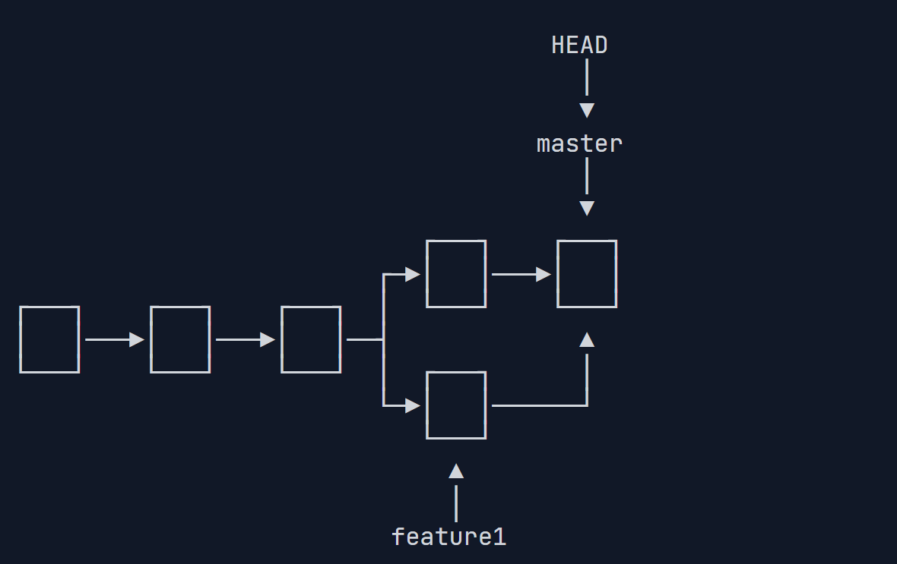
然后查看`git log`
```bash
long@LAPTOP-P0JHDVD6 MINGW64 /d/long_git/learn_git (master)     
$ git log --graph --pretty=oneline --abbrev-commit
*   3d83d01 (HEAD -> master) merge conflict fixed
|\
| * c843be7 (feature1) add AND simple
* | 09c0665 add & simple
|/
* ddd9ee8 branch test
* 565035f (origin/master) add SSH
* 78f0cac delete test.txt
* faf8957 ass test.txt
* f4ba602 git tracks changes
* 0c95123 understand how stage works
* d5c6451 append GPL
* 1197a5e add distributed
* 4b98757 wrote a readme file
```

##### git log
`git log --graph --pretty=oneline --abbrev-commit`
`git log`: 查看提交历史,显示每次提交的hash,作者,日期
`--graph`: 画**分支图**,`*`表示提交,`\|/`表示分支和合并路径
`--prety=oneline`: 将多行提交信息显示为一行
`--abbrev-commit`: 缩短`commit hash`,

#### 分支管理策略
通常的`git merge dev`若是使用`Fast farward`模式进行合并,合并后,若删除`dev`,那么该分支信息消失.(看不出来曾经做过合并)
若为了合并后保留有该分支信息,可以在合并时禁用`Fast forward`模式,这样就会**在合并时新建一个commit**
**示例**
创建新分支`dev`,修改,`add`,`commit`之后,切换到`master`
此时进行进行`merge`,但要禁止Fast forward模式:`git merge --no-ff -m "merge with no-ff" dev`
- `--no-ff`: 表示禁用`Fast farward`, 
- `-m`: 由于要创建新的`commit`,所以需要有注释信息
合并前

合并后
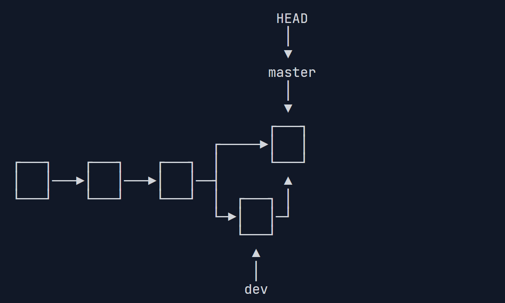

##### 分支管理基本原则
1. 首先，`master`分支应该是**非常稳定**的，也就是**仅用来发布新版本，平时不能在上面干活**
2. 那在哪干活呢？干活都在`dev`分支上，也就是说，`dev`分支是不稳定的，到某个时候，比如1.0版本发布时，再把`dev`分支合并到`master`上，在`master`分支发布1.0版本；
3. 你和你的小伙伴们每个人都在dev分支上干活，每个人都有自己的分支，时不时地往dev分支上合并就可以了。

所以，团队合作的分支看起来就像这样：
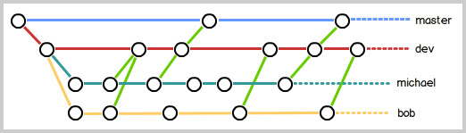

#### BUG分支
软件开发中，bug就像家常便饭一样。有了bug就需要修复，在Git中，由于分支是如此的强大，所以，**每个bug都可以通过一个新的临时分支来修复，修复后，合并分支，然后将临时分支删除**。

#####  工作区暂存`git stash`
**一个场景**: 在一个分支dev上,进行开发,已经对工作区进行了一些修改,还没有stage,此时突然需要紧急对master的一个bug进行修复,此时就需要`git stash`来**把此时的工作区内容"储藏"起来**,运行后,工作区变成未修改的状态
之后便可以切换到`master`来进行bug分支的管理,修复完bug并合并到主分支后,便可以切换回`dev`继续开发

切换到dev后,如何恢复之前的工作区?
`git stash list`: 查看之前"储藏"起来的工作区
恢复:
- `git stash apply`: 可以恢复,但是stash的内容并不删除,需要单独用`git stash drop`来进行删除
- `git stash pop`: 恢复的同时把`stage`内容也删了

##### 修复bug
分布走:
先切换到master分支
1. `git checkout -b issue-101`
2. 工作区进行修改,修复bug
3. `git add readme.txt`
4. `git commit -m "fix bug 101"`
5. `git switch master` 切换回主分支,准备合并
6. 合并: `git merge --no-ff -m "merged bug fix 101" issue-101`

##### 提交复制过来`cherry-pick`
当前状态为:
```bash
$ git log --graph --pretty=oneline --abbrev-commit
*   97e834f (HEAD -> master) merged bug fix 101
|\
| * 9c88076 (issue-101) fix bug 101
|/
*   8cec79a merge with no-ff
|\
| * 893627e (dev) add merge
|/
*   3d83d01 merge conflict fixed
|\
| * c843be7 (feature1) add AND simple
* | 09c0665 add & simple
|/
* ddd9ee8 branch test
* 565035f (origin/master) add SSH
* 78f0cac delete test.txt
* faf8957 ass test.txt
* f4ba602 git tracks changes
* 0c95123 understand how stage works
* d5c6451 append GPL
* 1197a5e add distributed
```
在`master`分支上修复了bug后，我们要想一想，dev分支是早期从`master`分支分出来的，所以，这个bug其实在当前dev分支上也存在。
**如何在`dev`也修复同样的bug**,可以用`cherry-pick`把`9c88076 (issue-101) fix bug 101`**这一提交"复制"到dev分支上**

首先切换到dev分支,然后执行`git cherry-pick 9c88076`(注意先把自己的工作内容stash).
```bash
$ git cherry-pick 9c88076
[dev e9fe130] fix bug 101
 Date: Wed Feb 4 11:21:23 2026 +0800
 1 file changed, 1 insertion(+), 1 deletion(-)
```
git会自动给dev分支进行一次提交(`[dev e9fe130] fix bug 101`),

#### feature分支
每添加一个新功能，最好**新建一个feature分支**，在上面开发，完成后，合并，最后，删除该feature分支

当完成一个feature并`add`和`commit`后,发现这歌供能不需要了,此时想要`彻底销毁`,就要用`git branch -D feature2`(注意先切换到master分支),若是用`-d`参数,git会提示该分支还未`merge`,不能直接删除

#### 分支远程推送策略
哪些分支需要推送，哪些不需要呢?
- `master`分支是主分支，因此**要时刻与远程同步**；
- `dev`分支是开发分支，团队**所有成员都需要在上面工作**，所以也**需要与远程同步**；
- `bug`分支只用于在本地修复bug，就没必要推到远程了，除非老板要看看你每周到底修复了几个bug；
- `feature`分支是否推到远程，取决于你是否和你的小伙伴合作在上面开发。

#### 远程抓取分支`pull`
`git push origin <branch>`: 表示把本地提交推送到远程库

在本地**`commit`之后,有时`push`会失败:
```bash
$ git push origin dev
To github.com:long6177/learn_git.git
 ! [rejected]        dev -> dev (fetch first)
error: failed to push some refs to 'github.com:long6177/learn_git.git'
hint: Updates were rejected because the remote contains work that you do not
hint: have locally. This is usually caused by another repository pushing to
hint: the same ref. If you want to integrate the remote changes, use
hint: 'git pull' before pushing again.
hint: See the 'Note about fast-forwards' in 'git push --help' for details.
```
推送失败,这是可能**由于在别处别人已经对这一分支进行过新的提交,并push到了远程库,你目前分支的提交并不是最新的**,因此在push之前,需要先用`pull`把该分支最新的提交从`origin/dev`上抓下来
分布走:
1. `git branch --set-upstream-to=origin/dev dev`: 先指定本地`dev`分支与远程`origin/dev`之间的链接
2. `git pull`: 进行拉取,假如远程别人的最新提交和你的最新提交有`merge conflict`的话,会先进行[合并冲突](#合并冲突merge-conflict)
3. 合并冲突后,`git push origin dev`便能成功推送

##### 多人协作工作模式
1. 首先，可以尝试用`git push origin <branch-name>`推送自己的修改；
2. 如果推送失败，则因为远程分支比你的本地更新，需要先用`git pull`试图合并；
3. 如果合并有冲突，则解决冲突，并在本地提交；
4. 没有冲突或者解决掉冲突后，再用`git push origin <branch-name>`推送就能成功！
如果`git pull`提示`no tracking information`，则说明本地分支和远程分支的链接关系没有创建，用命令`git branch --set-upstream-to <branch-name> origin/<branch-name>`。
这就是**多人协作的工作模式**，一旦熟悉了，就非常简单。

#### 减少分叉口`Rebase`
> rebase会改变**hash id**

当push出现标题[远程分支抓取](#远程抓取分支pull)中所述问题时,进行`git pull`后会出现类似下面的结构:
```bash
*   4223bc0 (HEAD -> master) fix merge conflict hello.py
|\
| * e0f541f (origin/master, origin/HEAD) hello.py set exit=1
* | fc021af hello.py add author
* | 0a14325 hello.py add comment
|/
* a101a07 init hello.py
*   11ec2b0 Merge branch 'dev'
......
```
这时候,一个`master`出现了**不必要的分叉**,为了便于查看历史,这时候**可以使用`rebase`命令来将分岔口给展平**

**此时运行`git rebase -i a101a07`**
之后会弹出交互式编辑界面,类似:
```bash
pick 0a14325 hello.py add comment
pick fc021af hello.py add author
pick e0f541f hello.py set exit=1
```
之后便可以基于`a101a07`进行**重新的单线合并**(具体操作可以ai,这里关于rebase不详细讲)
```bash
* 886a2cb (HEAD -> master) add author
* 0adc77a add comment
* e0f541f (origin/master, origin/HEAD) hello.py set exit=1
* a101a07 init hello.py
*   11ec2b0 Merge branch 'dev'
......
```
`rebase`还能够做到修改先前提交历史的**注释信息**,也是在上述的编辑界面进行操作
比如运行`git rebase -i HEAD^`进入交互界面,把`pick`改成`reword`,之后便能重新提交注释信息

### 六. 标签管理
**标签(tag)**实际上也是一个指向commit的指针,但与分支不同的是,分支可以移动，**标签是不能移动**
标签就是一个统一让人记住的易懂的有意义的名字,通过标签去查找版本库的快照更方便

#### 创建标签`git tag`
`git tag <tag_name>`: 给当前分支所处`commit`打上标签
`git tag`: 查看所有标签
`git tag <tag_name> <hash_id>`: 给指定`commit`打上标签
`git show <tag_name>`: 查看标签详细信息
`git tag -a v0.1 -m "version 0.1 released" 4b98757`
- `-a`指定标签名
- `-m`指定说明文字

#### 操作标签
`git tag -d v0.1`: 删除**本地**标签

正常创建的标签都是本地的,如果要推送到远程,可以使用:
`git push origin <tag_name>`
或者一次性推送所有本地标签: `git push origin --tags`
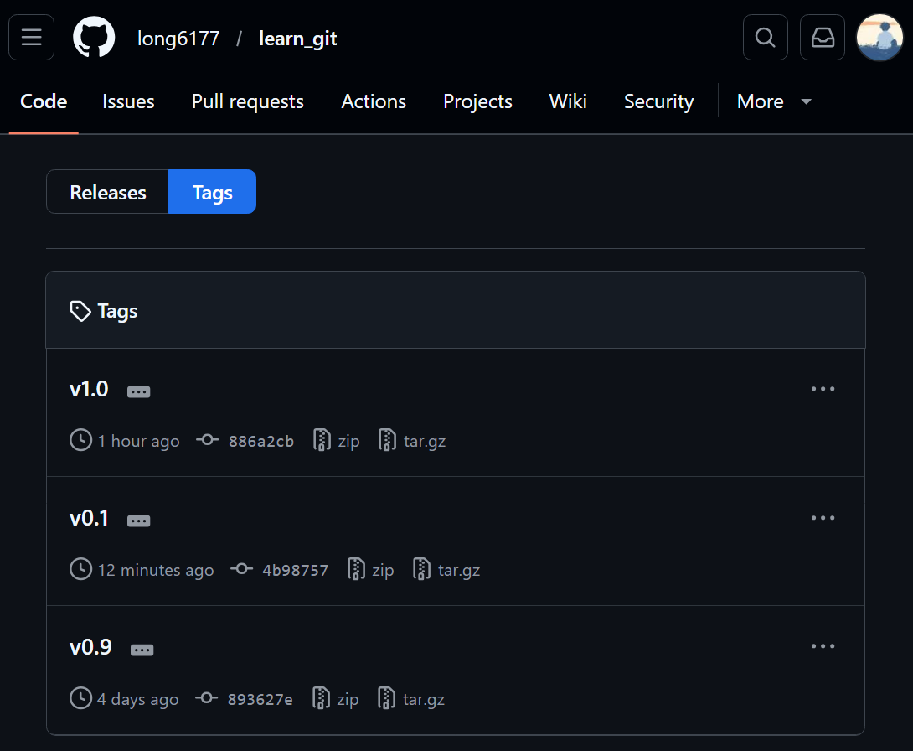

要删除已经推送到远程的tag:
1. `git tag -d <tag_name>`先删除本地
2. `git push origin :refs/tags/<tag_name>`: 把远程的删了
    - `<空>:refs/tags/v0.9`: 冒号左边表示本地,右边表示远程,左边为空代表删除,`refs/tags/v0.9`表示远程标签`v0.9`

### 七. 使用GitHub
平时使用github,若只是单纯的使用别人的项目,直接clone就可以

若是想要参与开源,给别人的仓库做出贡献,那么应该这么做:
1. 先点`Fork`把别人仓库克隆一个放到自己的github主页(Fork是任意的,没有影响)
2. 从自己的账号下克隆`git clone git@github.com:long6177/<repo_name>.git`
3. 在自己的本地修改后进行`git push`到自己的远程仓库
4. 若自己改的有价值,则可以发送一个`Pull Request`,等待对方接收

以著名的bootstrap项目为例来介绍**fork和clone后仓库间的关系**:
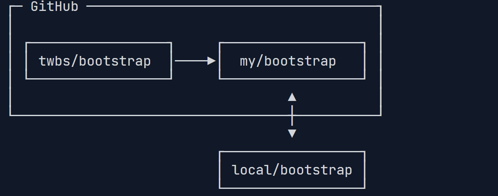

#### 八. Gitee
和GitHub相比，Gitee也提供免费的Git仓库。此外，还集成了代码质量检测、项目演示等功能。对于团队协作开发，Gitee还提供了项目管理、代码托管、文档管理的服务，**5人以下小团队免费**。

##### 配置Gitee的SSH
使用Gitee和使用GitHub类似，我们在Gitee上注册账号并登录后，需要先上传自己的SSH公钥。选择右上角用户头像 -> 菜单“设置”，然后在左侧菜单选择“SSH公钥”，填写一个便于识别的标题，然后把用户主目录下的`.ssh/id_rsa.pub`文件的内容粘贴进去：

##### 本地与gitee建立链接
`git remote add <name> git@gitee.com:liaoxuefeng/learngit.git`
和使用github类似,不过这里的<name>不能简单的写成`origin`,当一个本地库关联多个远程库时,就不能单单用一个`origin`来代表远程库了,应该用有意义的名字
比如,这里要和gitee远程联系,可以把`<name>`写成`gitee`
要是和github建立联系,则可以用`github`

**推送**,需要把先前讲的`git push origin master`中的`origin`给换成想要推送到的远程库`<name>`

#### 九. 自定义Git

##### 配置`.gitignore`
在git工作区的根目录下创建一个`.gitignore`文件,可不要忽略的文件名填进去(使用通配符),Git会自动忽略这些文件,这样在`git status`的`Untracked files`中也不会显示这些文件
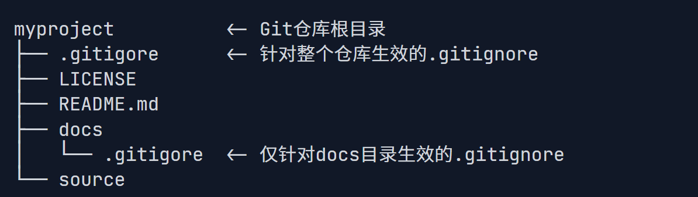

```.gitignore
# Python 相关

# Python bytecode
__pycache__/
*.py[cod]

# Virtual environments
.venv/
venv/
ENV/
env/
.env

# 编辑器 / IDE
.vscode/
.idea/

# 操作系统文件
# Windows
Thumbs.db
ehthumbs.db
Desktop.ini

# macOS
.DS_Store

# 日志 / 临时文件
*.log
*.tmp
*.swp

# （可选）自动生成的输出目录
# 如果以后有程序生成图片、模型、结果，建议放到 outputs/
outputs/
```

此时尝试添加一个文件`haha.pyc`会提示没法添加
```bash
$ git add App.class
The following paths are ignored by one of your .gitignore files:
App.class
Use -f if you really want to add them.
```
若必须要加上找个文件,可以有两种做法
1. `git add -f haha.pyc`: 用`-f`强制添加
2. 也可以修改`.gitignore`:
    - 可以把`*.py[cod]`这一行删了,但影响较大
    - 可以添加`!.haha.pyc`来把该文件作为例外
